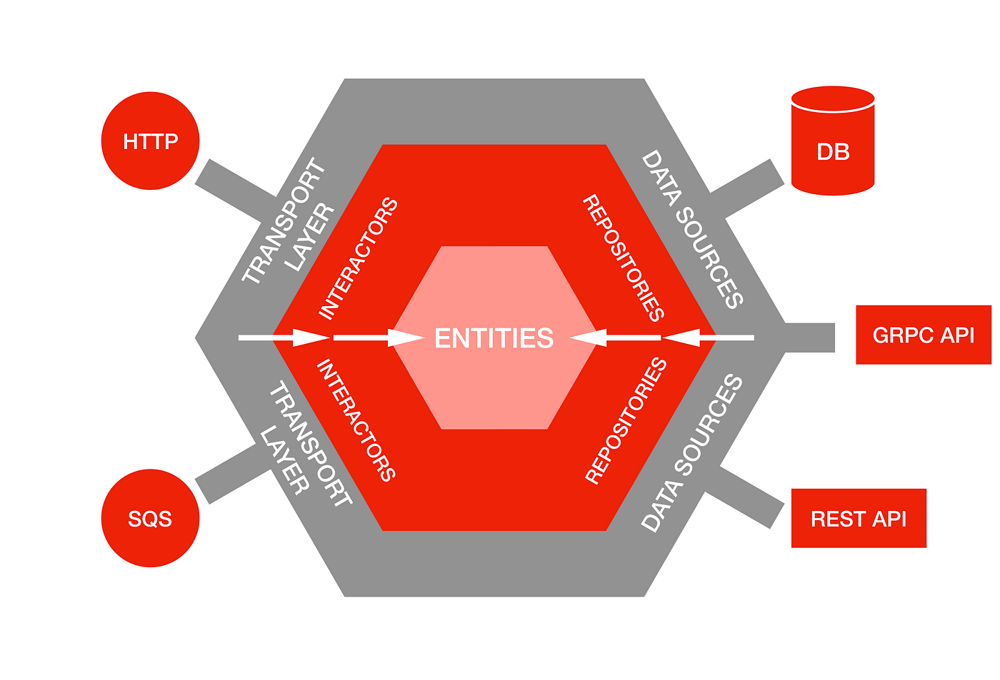

# Bank — Go Hexagonal Architecture


ตัวอย่าง Banking service เขียนด้วย Go ตามแนวคิด **Hexagonal Architecture (Ports & Adapters)**
เพื่อแยกส่วน business logic ออกจาก infrastructure (HTTP, Database) ให้ทดสอบและเปลี่ยน adapter ได้ง่าย

## สถาปัตยกรรม (Hexagonal / Ports & Adapters)

<p align="center">
  
</p>

<p align="center">
  <em>Source: <a href="https://miro.medium.com/v2/resize:fit:1400/1*NfFzI7Z-E3ypn8ahESbDzw.png">Medium</a></em>
</p>

## แนวคิด 
    core (**Entities**) อยู่ตรงกลาง ล้อมด้วย business logic แล้วค่อยเป็น adapter รอบนอก 
    สิ่งภายนอก (HTTP, SQS, DB, gRPC, REST) เสียบเข้าหา core ผ่าน port โดย core ไม่รู้จักตัวมันโดยตรง

| ในภาพ | ในโปรเจคนี้ |
| --- | --- |
| Transport Layer (HTTP) | `handler/` — driving adapter รับ HTTP ผ่าน gorilla/mux |
| Interactors | `service/` — business logic |
| Entities | `service.CustomerResponse` / `repository.Customer` — โมเดลข้อมูล |
| Repositories | `repository/` — port `CustomerRepository` |
| Data Sources (DB) | `customer_db.go` (Postgres), `customer_mock.go` (in-memory) |

> โปรเจคตัวอย่างนี้ทำเฉพาะฝั่ง HTTP → DB ส่วน SQS / gRPC / REST API ในภาพเป็นตัวอย่างว่า
> adapter อื่นๆ เสียบเข้า core เดิมได้โดยไม่ต้องแก้ business logic

การไหลของ dependency ชี้เข้าหา core เสมอ: `handler → service → repository`
โดยแต่ละชั้นคุยกันผ่าน **interface (ports)** ไม่ผูกกับ implementation จริง

```
        HTTP request
             │
             ▼
   ┌──────────────────┐   Driving adapter (REST)
   │     handler      │   แปลง HTTP ⇄ business call
   └──────────────────┘
             │  service.CustomerService (port)
             ▼
   ┌──────────────────┐   Core / business logic
   │     service      │   กฎทางธุรกิจ + response model
   └──────────────────┘
             │  repository.CustomerRepository (port)
             ▼
   ┌──────────────────┐   Driven adapter (data)
   │    repository    │   customer_db (Postgres) / customer_mock
   └──────────────────┘
             │
             ▼
         PostgreSQL
```

- **Ports** = interface (`CustomerService`, `CustomerRepository`)
- **Adapters** = implementation จริง เช่น `customer_db.go` (Postgres) และ `customer_mock.go` (สำหรับเทส/dev)

## โครงสร้างโปรเจค

```
bank/
├── main.go                    # bootstrap: อ่าน config, ต่อ DB, เดินสาย DI, สตาร์ท router
├── config.yaml                # ค่า app port และ database (viper)
├── handler/
│   └── customer.go            # HTTP handler (gorilla/mux)
├── service/
│   ├── customer.go            # port: CustomerService + CustomerResponse
│   └── customer_service.go    # business logic
├── repository/
│   ├── customer.go            # port: CustomerRepository + Customer model
│   ├── customer_db.go         # adapter: Postgres (sqlx)
│   └── customer_mock.go       # adapter: in-memory mock
└── migrations/
    └── init.sql               # สร้างตาราง Customers, Accounts + ข้อมูลตัวอย่าง
```

## การติดตั้งและรัน

### 1. เตรียม Database

สร้างฐานข้อมูล PostgreSQL แล้วรัน migration [migrations/init.sql](migrations/init.sql) — ทำได้ 2 วิธี:

**วิธีที่ 1: ใช้ command line (psql)**

```bash
createdb banking
psql -d banking -f migrations/init.sql
```

**วิธีที่ 2: ใช้ pgAdmin 4**

1. เปิด pgAdmin 4 แล้วสร้าง database ชื่อ `banking` (คลิกขวาที่ Databases → Create → Database…)
2. คลิกขวาที่ database `banking` → **Query Tool**
3. นำสคริปในไฟล์ `migrations/init.sql` ไปวางแล้วกด **Execute/Run**

### 2. ตั้งค่า config

แก้ค่าใน [config.yaml](config.yaml) ให้ตรงกับเครื่องคุณ:

```yaml
app:
  port: 8080

db:
  driver: "postgres"
  host: "localhost"
  port: 5432
  username: your-wsername
  password: your-password
  database: banking
```

### 3. รันเซิร์ฟเวอร์

```bash
go mod tidy
go run main.go
```

เซิร์ฟเวอร์จะขึ้นที่ `http://localhost:8080`

## API Endpoints

| Method | Path                      | คำอธิบาย                  |
| ------ | ------------------------- | ------------------------- |
| GET    | `/customers`              | ดึงรายชื่อลูกค้าทั้งหมด    |
| GET    | `/customers/{customerID}` | ดึงลูกค้าตาม ID            |

### ตัวอย่าง

```bash
// ใน windows ต้อง curl ใน Git Bash
curl http://localhost:8080/customers
curl http://localhost:8080/customers/2000
```

Response:

```json
{
  "customer_id": 2000,
  "name": "Steve",
  "status": 1
}
```

> `Customer` ใน repository มีฟิลด์ครบ (`customer_id`,`name`, `date_of_birth`, `city`, `zipcode`, `status`)
> แต่ `CustomerResponse` ที่ service ส่งออกจะเปิดเผยเฉพาะ `customer_id`, `name`, `status`
> เป็นตัวอย่างการแยก domain model ออกจาก response model

## หมายเหตุเรื่อง Go

- ชื่อไฟล์นิยมใช้ `snake_case` (ไม่บังคับ แค่ช่วยให้อ่านง่าย)
- การเป็น public/private ดูจากอักษรตัวแรกของชื่อ: ตัวใหญ่ = public (export), ตัวเล็ก = private
